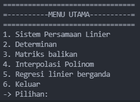

# Matriks - Algeo01-20025
> Program Matriks untuk Tubes 1 Algeo.

## Daftar Isi
- [Matriks - Algeo01-20025](#matriks---algeo01-20025)
  - [Daftar Isi](#daftar-isi)
  - [Tentang Program](#tentang-program)
  - [Tampilan Menu Utama](#tampilan-menu-utama)
  - [Buka Program](#buka-program)
  - [Dibuat Oleh](#dibuat-oleh)

## Tentang Program
Kode terbagi menjadi 2 file java, yaitu Matriks.java dan Driver.java. Matriks.java berisi berbagai fungsi dan prosedur yang nantinya digunakan untuk program akhir, sedangkan Driver.java berupa Program akhir yang dibentuk dengan rangkaian fungsi dan prosedur pada Matriks.java.

## Tampilan Menu Utama

## Buka Program
1. Membuka folder src melalui cmd
2. Mengetik dan menjalankan `javac Driver.java`
3. Mengetik dan menjalankan `java Driver`
4. Program sudah bisa dicoba

## Dibuat Oleh
- 13520025 Fransiskus Davin Anwari
- 13520069 Kent Liusudarso
- 13520111 Rizky Akbar Asmaran